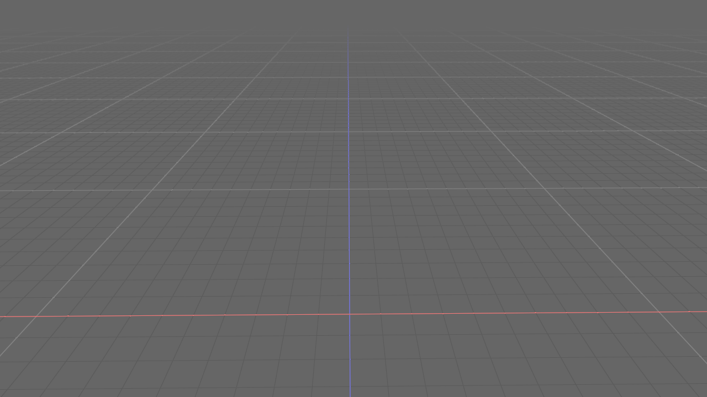

<div align="center">

# Bevy Infinite Grid

**Simple 3D infinite grid for bevy**

[](https://crates.io/crates/bevy_infinite_grid)
[](https://docs.rs/bevy_infinite_grid)
[](https://github.com/bevyengine/bevy/blob/main/docs/plugins_guidelines.md#main-branch-tracking)
[](https://github.com/ForesightMiningSoftwareCorporation/bevy_infinite_grid/actions/workflows/release.yml)



</div>

# Demo

Run a simple implementation of this grid by cloning this repository and running:

```shell
cargo run --example simple
```

# Features

* Easily spawn an infinite grid aligned to the world origin and axes
* Spawn an unlimited number of axes aligned to arbitrary coordinate spaces

# Usage

Add the plugin to the `[dependencies]` in `Cargo.toml`

```toml
bevy_infinite_grid = { git = "https://github.com/ForesightMiningSoftwareCorporation/bevy_infinite_grid", branch = "main" }
```

Insert the infinite grid plugin after the default plugins.

```rust
.add_plugins(InfiniteGridPlugin)
```

And spawn the grid to see the results.

```rust
commands.spawn(InfiniteGridBundle::new(
    materials.add(InfiniteGridMaterial::default()),
));
```

See the [simple](examples/simple.rs) demo for an example of a minimal implementation.

## Bevy Version Support

We intend to track the `main` branch of Bevy. PRs supporting this are welcome!

| bevy | bevy_infinite_grid |
| ---- | ------------------ |
| 0.13 | 0.11               |
| 0.12 | 0.10               |
| 0.11 | 0.8, 0.9           |

## License

bevy_infinite_grid is free and open source! All code in this repository is dual-licensed under either:

* MIT License ([LICENSE-MIT](LICENSE-MIT) or [http://opensource.org/licenses/MIT](http://opensource.org/licenses/MIT))
* Apache License, Version 2.0 ([LICENSE-APACHE](LICENSE-APACHE) or [http://www.apache.org/licenses/LICENSE-2.0](http://www.apache.org/licenses/LICENSE-2.0))

at your option. This means you can select the license you prefer! This dual-licensing approach is the de-facto standard in the Rust ecosystem and there are very good reasons to include both.

Unless you explicitly state otherwise, any contribution intentionally submitted for inclusion in the work by you, as defined in the Apache-2.0 license, shall be dual licensed as above, without any additional terms or conditions.

## Sponsors

The creation and maintenance of Bevy Infinite Grid is sponsored by Foresight Spatial Labs.

<div align="center">

</div>
